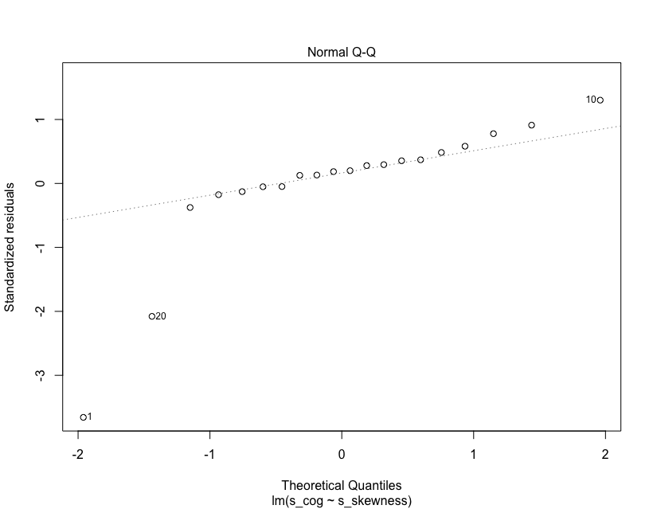

background-image: url(https://external-preview.redd.it/lIPUeKFOI5tcj85H8fcNgjGWLAGGNAbCvde-mkqhaN4.png?auto=webp&s=52345cf9d85662cbc2c0019c162e1fe801db3464)

```{r setup, include=FALSE}
options(htmltools.dir.version = FALSE)
```

???

Image credit: [Wikimedia Commons](https://external-preview.redd.it/lIPUeKFOI5tcj85H8fcNgjGWLAGGNAbCvde-mkqhaN4.png?auto=webp&s=52345cf9d85662cbc2c0019c162e1fe801db3464)

---
class: center, middle 

## Assigment 4
### Fricatives
```{r, warnings=F, message=F, echo=FALSE}
library(tidyverse)
library(ggplot2)
library(Hmisc)


fricatives <- read_csv ("/Users/jimenez/Desktop/R.Statistics/pa4/data_raw/fricatives.csv")

summary.data.frame(fricatives)
```
---
class: center, middle 

## AMAZING SUMMARY of TIDY_DATA
### Fricatives
```{r, warnings=F, message=F, echo=FALSE}

data_tidy <- read_csv ("/Users/jimenez/Desktop/R.Statistics/pa4/data_tidy/data_tidy.csv")

summary(data_tidy)


```
---
class: center, middle 

## AMAZING Plot
###Boxplot of center of gravity as a function of phoneme
```{r, warnings=F, message=F, echo=FALSE}
library(ggplot2)
#create plot with data_reception

 boxplot(cog ~ phoneme, data = data_tidy, main="Boxplot of center of gravity as a function of phoneme", sub="by Jimenez",
   ylab="Center of Gravity")

```
---
class: center, middle
## and YET another AMAZING Plot
###Boxplot of skewness as a function of phoneme
```{r, warnings=F, message=F, echo=FALSE}

#create plot with data_reception

 boxplot(skewness ~ phoneme, data = data_tidy, options (digits = 2), main="Boxplot of center of gravity as a function of phoneme", sub="by Jimenez",
   ylab="Skewness")
```
---
class: center, middle
## Center of Gravity as a function of skewness for the S phoneme 
```{r, warnings=F, message=F, echo=FALSE}
###Fit a model that examines center of gravity as a function of skewness for the [s] segments (hint: you will have to transform the data). Make a table of the model summary.

fricatives <- read_csv ("/Users/jimenez/Desktop/R.Statistics/pa4/data_raw/fricatives.csv")

mod <- lm (formula = s_cog ~ s_skewness, data = fricatives)
summary(mod)
```
---
class: center, middle

###Fit a model that examines center of gravity as a function of skewness for the [s] segments  Make a table of the model summary.

 


---
class: inverse, center, middle

# The dog ate my summary of the statistics


---
